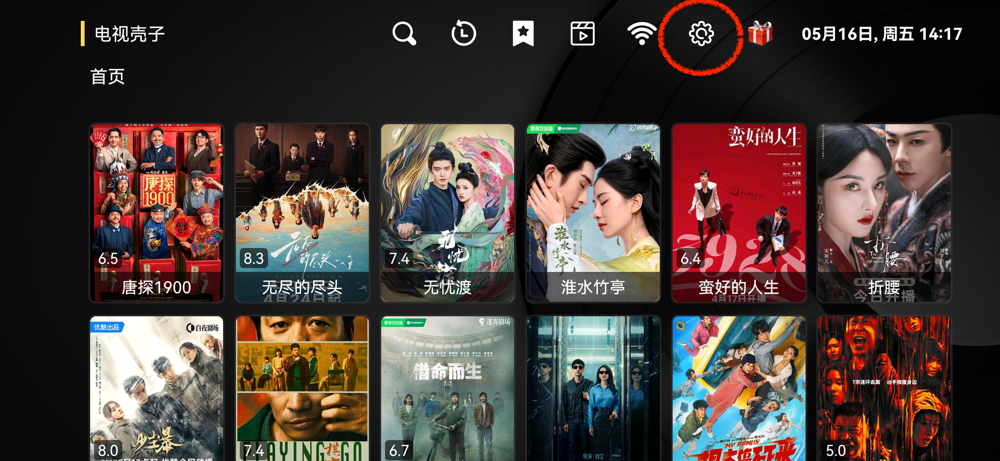
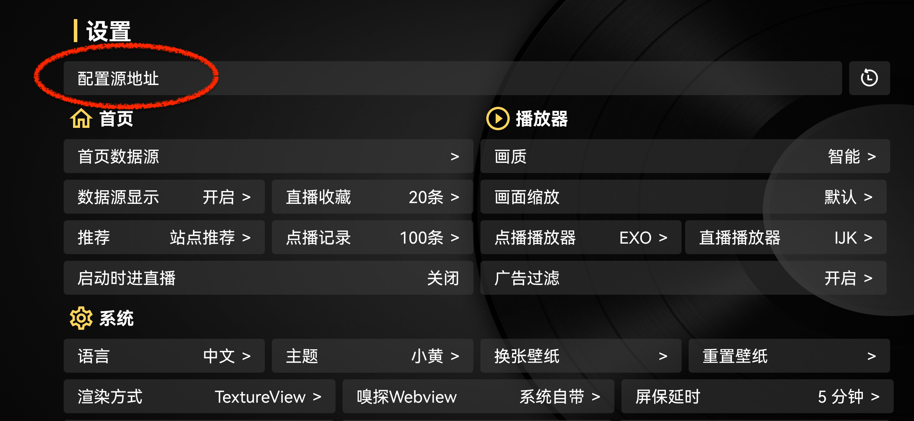
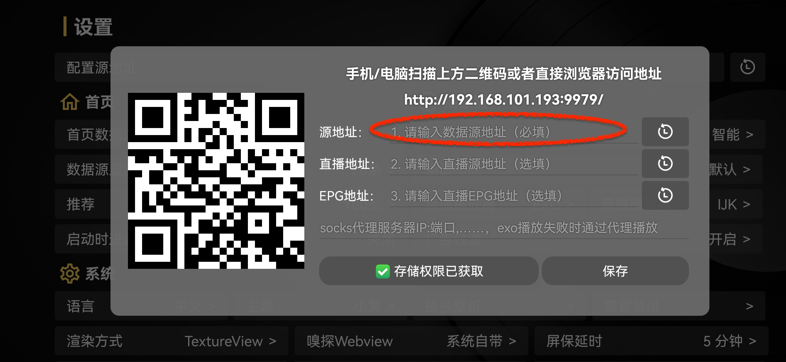
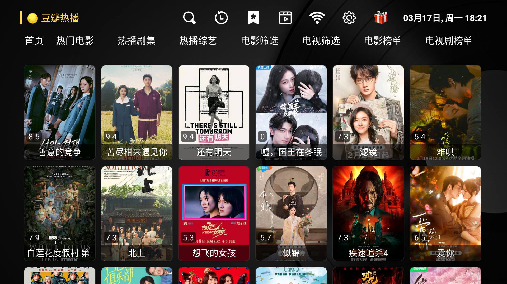
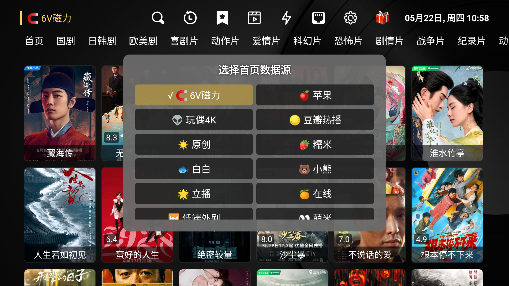
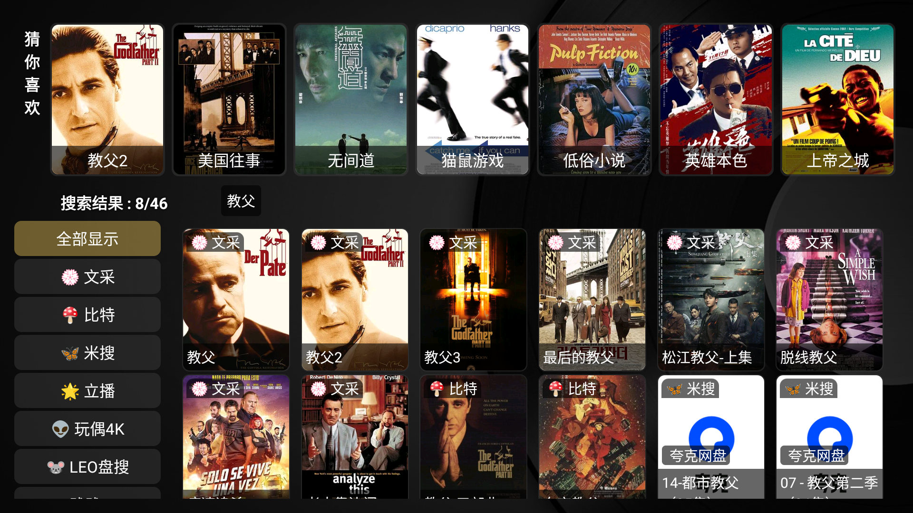
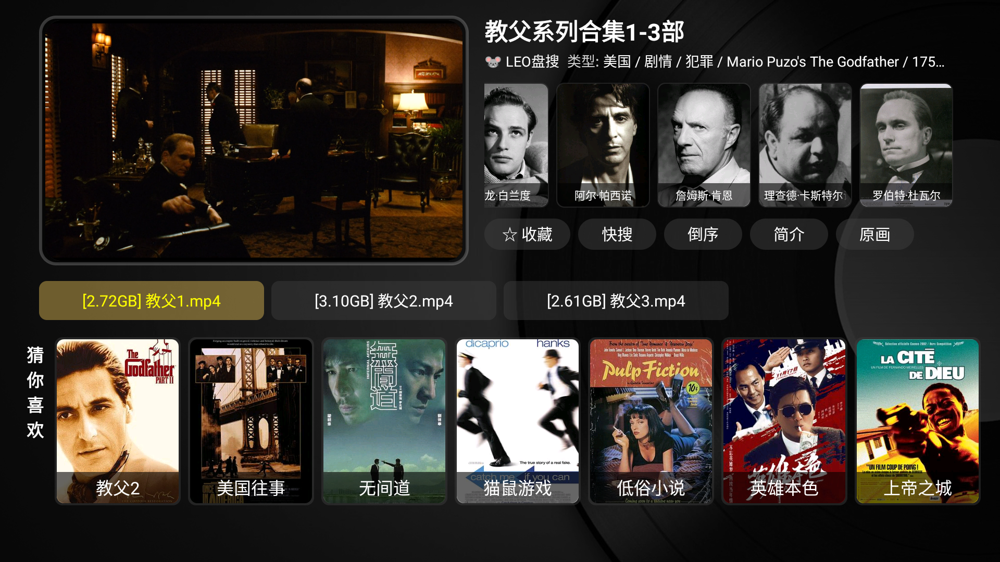
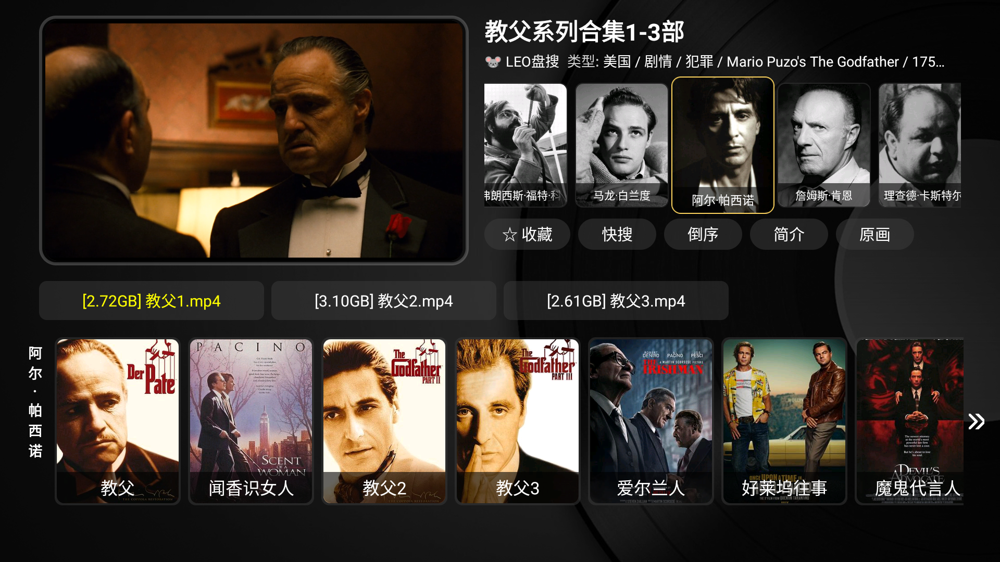
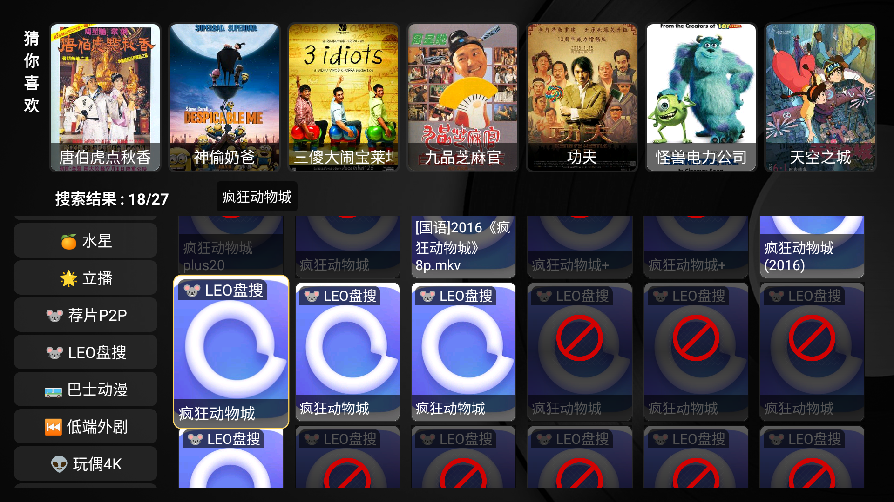
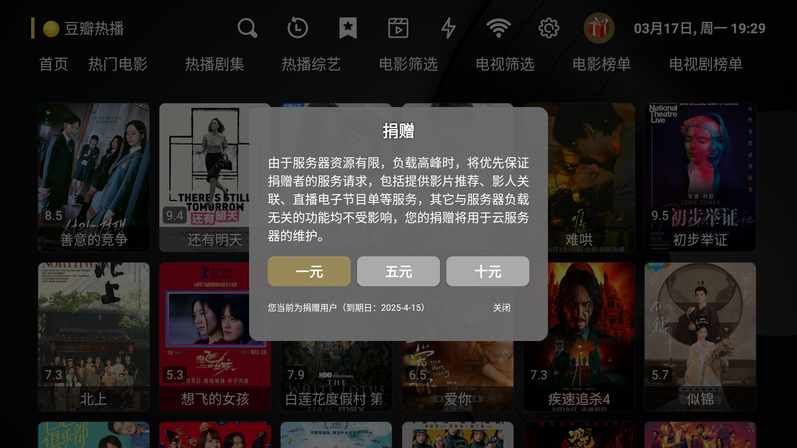

<h1 align="center">电视壳子（ShellTV）</h1>

- [快速上手](#-快速上手)
- [关于此项目](#-关于此项目)
- [对源配置文件语法的扩展](#️-对源配置文件语法的补充定义)
- [界面截图](#-界面截图)
- [玩法](#-玩法)
- [关于IPTV](#-关于iptv)
- [捐赠](#-捐赠)

---

## 🍔 快速上手
- 上网搜索“tvbox 最新配置”，复制url地址(如， http://... )，进入APP的设置页面，将url地址输入到“源地址”位置（可以手动输入，或通过同一局域网中的手机或电脑远程输入），保存、退出。

---

## 📌 关于此项目
- 本项目修改自开源项目 https://github.com/CatVodTVOfficial/TVBoxOSC 在此致敬！🌹🌹🌹 
- 与原开源项目（TvBox）相比，本项目在功能上没有太多改进，主要是依个人喜好对操作体验进行了一些优化：
    - 增加基于影片的关联推荐，以及基于影人的关联推荐
    - 对数据源文件的语法定义进行了扩展，以更好处理影片元数据缺失问题（如海报等）
    - 直播节目收藏等其它一些功能
- 联系我们:  QQ_ 3877275490 ,邮件_ 3877275490@qq.com
  
ℹ️ 由于TVBox采用“数据源插件+APP框架”的结构，数据源与框架的兼容性问题不可避免，个别数据源会引发“电视壳子”闪退，甚至无法进入APP。遇到此类情况，可以选择更换数据源，或进入安卓设备的系统设置，清除“电视壳子”的数据（相当于恢复出厂设置），或删除后重新安装“电视壳子”。

ℹ️ 由于条件有限，本项目的开发测试主要基于机顶盒和[有限的几个源](source.md)，可能无法满足所有设备和源的兼容性，请谅解。如果你发现闪退等bug可以QQ我，并注明你所使用的设备、源以及具体操作，如果我有条件重现问题，我会尽力修改。

ℹ️ 本项目发布版使用armeabi-v7a库编译，如果源插件中调用arm64-v8a库可能会出现闪退。

--- 

## 🛠️ 对源配置文件语法的扩展
为改进用户体验，**电视壳子**对TvBox项目的[源配置文件的基础语法](./tvbox源配置文件基本语法.md)进行了扩展，如果你是进阶玩家（致力于定制属于自己的配置文件），可以使用这些扩展定义，并配合**电视壳子**使用，以获取更好的使用体验（如，避免收藏与历史记录中出现大量无意义的海报，或屏蔽已失效的阿里资源）。这些语法扩展多用于网盘搜索类、原数据无人维护的源。

以下是这些扩展语法的语义描述：

| 属性       | 描述                     | 缺省值   |
|------------|--------------------------|--------|
| hasPoster| 该站点提供海报，1：提供，0：不提供  | 1 |
| hasMeaningfulTitle| 该站点提供准确标题，1：提供，0：不提供| 1 |
| hasTags       | 该站点提供影片的原数据（类型、国家等），1：提供，0：不提供      | 1|
| checkAlipan       | 检查该站点阿里资源的有效性，1：检查，0：不检查      | 0|

样例如下：
[源配置样例.json](./源配置样例.json)

--- 

## 📺 界面截图

### 主页

### 数据源选择

### 搜索页

### 详情页

**

### 影人关联

### 无效阿里源屏蔽

--- 

## 🔑 玩法

#### 1. 入门玩家
（1）百度或Github 搜索配置文件，复制URL地址，关键词：TVBox配置（最好先在电脑上试一下配置文件是否能正常下载，[这里](./source.md)是的几个网上搜索到的源，请自行确认其版权的合法性）。

（2）进入[APP配置源地址界面](./images/config.png) ➜ 直接输入URL地址或在[远程控制界面](./images/config_pc.png)中输入URL地址 ➜ 确定保存、退出

   ⚠️ 入门玩家可能受制于源配置服务器的稳定性

#### 2. 进阶玩家 (指那些有定制需求的玩家)
（1）百度或Github 搜索、下载一个你基本满意的配置文件，作为模板（⚠️ 如果你想做全套，还要将这个源配置文件中索引的其它文件一并下载，如.jar和.m3u文件等）

（2）根据[基础语法](./tvbox源配置文件基本语法.md)和[扩展语法定义](#️-对源配置文件语法的补充定义)，对模板进行修改，包括，删除、排序或拼接等（⚠️ 修改过程中要确保其中的索引文件地址正确，你可能需要将原有的相对地址改为绝对地址，或将原有的绝对地址改为相对地址）

（3）获取机顶盒文件[存储权限](./images/rights.jpg)。

（4）将修改后的配置文件（.json）和相关的其它文件（.jar, .m3u）上传到机顶盒：打开[APP源配置界面](./images/config.png) ➜ [用电脑或手机连接](./images/config_pc.png) ➜ [创建一个文件夹](./images/folder.jpg)（如 shelltv） ➜ 将配置文件上传至该文件夹 ➜ [在APP源配置界面“源地址”一栏中填写正确地址](./images/source.png), 或直接点击[刚刚上传的配置文件](./images/new_local_file.png)，然后[选择clan开头的地址](./images/clan.png)，点击【使用】按钮（如果是手工填写地址，以下两种格式均可，`http://localhost:9978/file/shelltv/源配置样例.json` 或 `clan://localhost/shelltv/源配置样例.json`，其中，shelltv是刚刚创建的方件夹，源配置样例.json是上传的配置文件、9978是[APP源配置界面](./images/config.png)上显示的端口号，“localhost”和“file”是固定的，如果系统中有多个tvbox版本，推荐使用后一种地址，以避免端口冲突） ➜ 确定保存并退出。(⚠️ 一个测试以上配置是否正确的方法是，将上面前一种地址（http开头）输入到处于同一局域网的电脑浏览器的地址栏中，将localhost换成机顶盒的实际地址，应该可以下载这个文件)

   ⚠️ 由于配置文件在本地，整体上看，进阶玩家可以享受相对稳定的服务，但需要定期自行检查、更新各站点的可用性

--- 

## 📥 关于IPTV
**电视壳子**支持IPTV直播源，但是由于IPTV直播源的特殊性，我们不提供IPTV直播源的配置文件，用户可以按如下步骤自行搜索IPTV直播源的配置文件，然后上传到机顶盒中使用。

1.根据你所在地区和宽带提供商，在github或百度搜索并下载相应的IPTV组播地址文件，关键字：iptv 组播（比如 https://github.com/xisohi/IPTV-Multicast-source ）（一个测试你所找到的iptv组播地址是否可用的方法是：在家中的局域网中，将其中一个组播ip地址输入电脑浏览器的地址栏，如 rtp://239.3.1.241:8000，看是否能正常播放。）

2.按以下两种格式中的一种修改、生成tvbox直播配置文件：[直播配置传统格式](./直播配置传统格式.m3u)（group-title标识分组）、[直播配置简化格式](./直播配置简化格式.m3u)（#EXTGENRE 标识分组）

3.获取机顶盒文件[存储权限](./images/rights.jpg)。

4.将修改后的配置文件（.m3u）上传到机顶盒：打开[APP源配置界面](./images/config.png) ➜ [用电脑或手机连接](./images/config_pc.png) ➜ [创建一个文件夹](./images/folder.jpg)（如 shelltv） ➜ 将直播配置文件上传至该文件夹 ➜ [在APP源配置界面“源地址”一栏中填写正确地址](./images/iptv.png)（例如，`http://localhost:9978/file/shelltv/源配置样例.json` ，其中，shelltv是刚刚创建的方件夹，源配置样例.json是上传的配置文件、9978是[APP源配置界面](./images/config.png)上显示的端口号，“localhost”和“file”是固定的） ➜ 确定保存并退出。(⚠️ 一个测试以上配置是否正确的方法是，将上面前一种地址（http开头）输入到处于同一局域网的电脑浏览器的地址栏中，将localhost换成机顶盒的实际地址，应该可以下载这个文件)

4.在**电视壳子**主页，点击直播，即可看到[直播节目](./images/broadcast.png)。（⚠️ 注意选择正确的播放器，通常是IJK，你也可以在[源配置文件（.json）](./源配置样例.json)中指定）

    ⚠️ 如果你是进阶玩家，可以在[源配置文件（.json）](./源配置样例.json)中引用已上传到机顶盒的[直播配置文件（.m3u）](./直播配置传统格式.m3u)，无需在系统设置中另行[配置直播源](./images/iptv.png)。

## 🎉 捐赠
**电视壳子**部分特色功能依赖于服务器资源，为覆盖基本开销，我们接受捐赠。您的捐赠将用于云服务器的维护，并支持我们走得更远。

捐赠方式：应用首页  ➜  【捐赠】按钮

